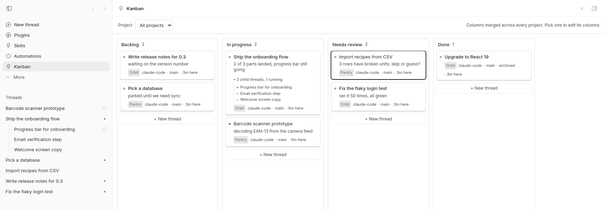

# Kanban for bb

With a dozen agent threads running across several projects, [bb](https://github.com/get-bb/bb)'s sidebar tells
you which ones are busy but not where each piece of work stands. This plugin
adds a board where every card is a bb thread, and the agents move their own
cards as the work changes.



*Demo projects and threads written for the screenshot. bb 0.45.*

**Status: maintained.** It works on bb 0.44 and 0.45, and I keep it working
as bb releases new versions. Issues and pull requests are welcome.

[Build checks](https://github.com/davideiffert/bb-plugin-kanban/actions/workflows/check.yml) · [Changelog](CHANGELOG.md) · [MIT license](LICENSE)

## Try it

```sh
bb plugin install git:https://github.com/davideiffert/bb-plugin-kanban@^0.2.0
```

Then open **Kanban** in bb's sidebar. Your recent threads are already on it.

## How it works

The plugin stores each card's column, order, and one-line note, plus a cached
copy of the thread's last message. Titles, run status, and branch are read live
from bb, so a card can't disagree with its thread.

**Cards move themselves.** With `autoAdvance` on (the default), automation only
moves a card out of the columns named in this table. A card you put in Done or
in a column you added stays there.

| Thread event | Card move |
| --- | --- |
| Created | Backlog |
| Starts running | Backlog or Needs review → In progress |
| Goes idle or fails | In progress → Needs review |
| Archived | Done |
| Deleted | Card removed |

**Agents move their own cards.** The plugin ships a `kanban-board` skill that
tells agents to move their card when they start, get blocked, or need review,
with a one-line note saying why. They use a native tool or the CLI:

```jsonc
kanban_move_card { "column": "review", "note": "needs your call on the schema" }
```

```sh
bb kanban move doing --note "wiring the importer"
```

**Only you mark work done.** Dropping a card in Done archives its thread, and
dragging it back out unarchives it. If archiving fails, the card stays where
it was. An agent that asks for Done lands in Needs review instead and is told
why. If the board has no Needs review column, the agent's move is refused. This matters because when the last thread in a
managed worktree is archived, bb deletes that worktree and its branch. An agent
reporting success should not be able to delete its own working folder.

## The board

- **All projects** is the default view. Columns merge by role, so every
  project's "Needs review" cards share one column, each with a project chip.
  Pick a single project to add, rename, or delete its columns.
- **Click a card** to read and reply to its thread in bb's chat panel beside
  the board. The selection is in the URL, so you can link to a card.
- **Child threads roll up.** A thread spawned by another one shows as a thin
  row under its top-level parent's card, even when it runs in a different
  project. A card shows up to 20 of them. The
  rows stay open while a child is running or waiting on you, then fold into a
  count.
- **Each card shows** the agent's note or last message and how long since the
  card last moved (`3h here`), which is how you spot stalled work.
- **Card buttons.** `✎` renames the thread in bb. `↗` opens the full thread
  page. `✕` takes the card off the board and leaves the thread alone. A
  removed card is not added back automatically; moving it with the CLI or the
  agent tool puts it back.
- **+ New thread** in a column opens bb's composer and puts the new thread in
  that column. If the project you pick doesn't have that column, the card goes
  in its first column.
- **Narrow windows** keep In progress and Needs review readable and collapse
  the other columns into strips you can still drop cards on.
- **Screens under 768px wide**, like phones, show one column at a time with a
  "Move to" picker on each card.
- Deleting a column moves its cards to the project's first column.
- Finished cards leave the board after 7 days. The threads stay in bb.

## The CLI

```sh
bb kanban board                       # every project (or the current thread's project)
bb kanban board --project <proj_id>   # one project
bb kanban move review --thread <thr_id> --note "ready for a look"
bb kanban note "blocked on staging credentials"
bb kanban columns --project <proj_id>
```

A column can be named by its id, its display name, or its role: `todo`,
`doing`, or `review`. Inside a thread, `move` and `note` act on that thread.

## Settings

| Setting | Default | Meaning |
| --- | --- | --- |
| `autoAdvance` | on | Move cards from thread events |
| `backfillDays` | `14` | Add threads updated within this many days to the board (`0` turns it off) |
| `archiveOnDone` | on | Archive a thread when you drop its card in Done, and unarchive it when you drag it out |
| `doneVisibleDays` | `7` | Hide finished cards after this many days (`0` keeps them) |

```sh
bb plugin config kanban set archiveOnDone false
```

## Limits

- Tested on bb 0.44 and 0.45. It uses parts of bb's plugin SDK marked
  experimental (the chat tab, the composer, thread renaming), so a later bb
  release can break it.
- Card positions and notes live in the plugin's own storage, not in your
  threads. The board never deletes a thread; only Done archives one.
- Drag and drop needs a mouse. Phones get the "Move to" picker instead, but a
  touch screen wider than 768px, like a tablet, gets neither.
- The board reads up to 500 open and 300 archived threads across all
  projects. On a bigger server, cards for older threads drop off without a
  warning.
- An agent only moves its card if it follows the bundled skill. Automatic
  moves cover the rest.

## Development

```sh
npm ci
npm run typecheck
npm test
npm run build
bb plugin install .   # install your local copy
```

`bb plugin dev` rebuilds and reloads on save.

## License

[MIT](LICENSE). Created by David Eiffert. Not affiliated with bb.
